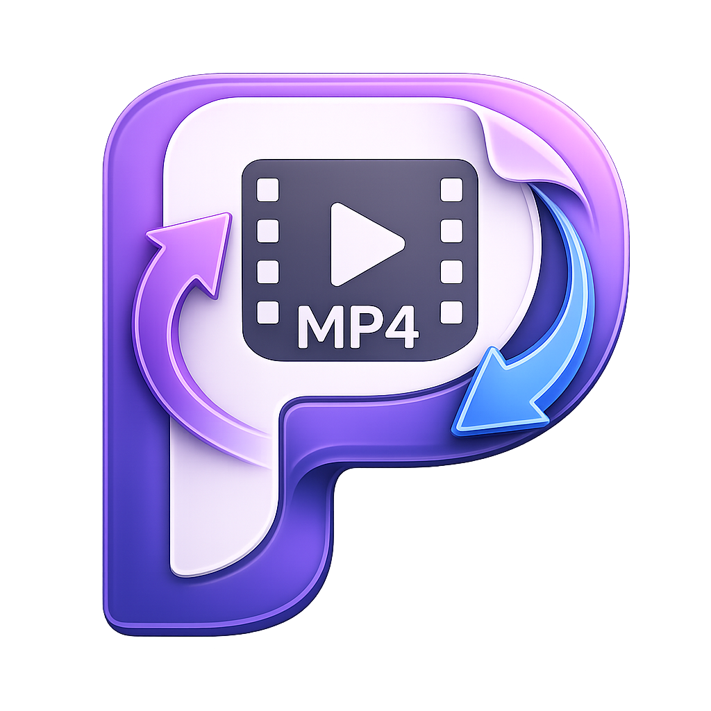
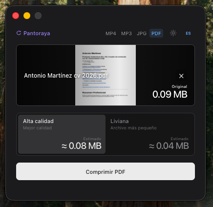

<p align="center">
  
</p>

<h1 align="center">Pantoraya</h1>

<p align="center">
  Conversión privada de archivos para macOS y Windows · Private file conversion for macOS and Windows<br>
  Video, audio, imágenes y PDF procesados localmente · Video, audio, images, and PDFs processed locally
</p>

<p align="center">
  <a href="#español">Español</a> ·
  <a href="#english">English</a> ·
  <a href="https://github.com/VodoooFilms/pantoraya/releases/latest">Descargar / Download</a> ·
  <a href="LICENSE">MIT</a>
</p>

<p align="center">
  
</p>

## Español

Pantoraya es un conversor gratuito, pequeño y de código abierto para macOS y Windows. Arrastra un archivo y la aplicación seleccionará automáticamente el espacio correcto: MP4 para video, MP3 para audio, JPG para imágenes o PDF para comprimir PDFs y convertir documentos.

Todo se procesa de forma privada en tu computadora. No hay cuentas, suscripciones, publicidad, analítica ni cargas a la nube.

### Funciones

- Conversión MP4 en alta calidad o versión liviana de hasta 720p
- Pista SRT opcional integrada al MP4
- Conversión MP3 y extracción de audio desde video a 320 o 128 kbps
- Compresión JPG conservando las dimensiones o reduciendo a un máximo de 1280 px
- Compresión PDF local en alta calidad o versión liviana
- Conversión de DOC, DOCX, TXT, RTF y ODT a PDF
- Conversión directa de JPG/JPEG a PDF dentro del espacio PDF
- Detección automática del tipo de archivo
- Miniaturas proporcionales sin deformación
- Peso original y estimación del resultado en MB
- Progreso en tiempo real y sonido sutil al finalizar
- Temas claro y oscuro
- Interfaz completa en español e inglés

### Formatos compatibles

| Espacio | Entrada | Salida | Modos |
| --- | --- | --- | --- |
| MP4 | MOV, MP4, M4V, AVI, MKV, WEBM + SRT opcional | MP4 H.264 + AAC + subtítulos opcionales | Alta calidad · Liviana 720p |
| MP3 | MP3, WAV, M4A, AAC, FLAC, OGG, OPUS, WMA, AIFF y video | MP3 | 320 kbps · 128 kbps |
| JPG | JPG, JPEG, PNG, WEBP, BMP, TIFF | JPG | Dimensiones originales · Liviana 1280 px |
| PDF | PDF, JPG, JPEG, DOC, DOCX, TXT, RTF, ODT | PDF optimizado o convertido | Alta calidad · Liviana; conversión directa de imágenes y documentos |

### Cómo añadir subtítulos SRT

La opción SRT está disponible tanto en macOS como en Windows. Selecciona el espacio **MP4** y carga un archivo de video; entonces aparecerá **+ Añadir subtítulos SRT (opcional)**. Selecciona o arrastra un archivo `.srt` y convierte el video. Pantoraya incorpora los subtítulos como una pista opcional dentro del MP4, por lo que puedes activarla o desactivarla desde el reproductor.

### Instalar

Pantoraya es compatible con Windows 10/11 de 64 bits y con Macs Apple Silicon que ejecuten macOS 13.4 o posterior.

En Windows, descarga y ejecuta `Pantoraya-1.3.0-x64.exe`. El instalador permite elegir la carpeta y crea accesos directos. La conversión multimedia, de imágenes y PDF funciona con los motores incluidos; para convertir DOC, DOCX, TXT, RTF u ODT se necesita Microsoft Word instalado. Las compilaciones comunitarias de Windows aún no están firmadas, por lo que SmartScreen puede mostrar una advertencia.

En macOS:

1. Descarga el DMG desde [GitHub Releases](https://github.com/VodoooFilms/pantoraya/releases/latest).
2. Abre el DMG y arrastra Pantoraya a Aplicaciones.
3. En el primer inicio, permite el acceso solicitado a Escritorio, Documentos y Descargas.

Las compilaciones comunitarias no están notarizadas. Si macOS bloquea el primer inicio, haz clic derecho sobre Pantoraya y selecciona **Abrir**.

También está disponible una [edición independiente del README en español](README.es.md).

---

## English

Pantoraya is a small, free, open-source file converter for macOS and Windows. Drop a file into the app and it automatically chooses the correct workspace: MP4 for video, MP3 for audio, JPG for images, or PDF for PDF compression and document conversion.

Everything is processed privately on your computer. There are no accounts, subscriptions, ads, analytics, or cloud uploads.

### Features

- High-quality or lightweight 720p MP4 conversion
- Optional SRT subtitle track embedded in the MP4
- MP3 conversion and audio extraction from video at 320 or 128 kbps
- JPG compression at original dimensions or a lightweight 1280 px maximum
- Local PDF compression in high-quality or lightweight mode
- DOC, DOCX, TXT, RTF, and ODT to PDF conversion
- Direct JPG/JPEG to PDF conversion inside the PDF workspace
- Automatic file-type detection
- Proportional thumbnails without stretching
- Original and estimated output sizes displayed in MB
- Real-time progress and a subtle completion sound
- Light and dark themes
- Complete English and Spanish interface

### Supported formats

| Workspace | Input | Output | Modes |
| --- | --- | --- | --- |
| MP4 | MOV, MP4, M4V, AVI, MKV, WEBM + optional SRT | H.264 + AAC MP4 + optional subtitles | High quality · Lightweight 720p |
| MP3 | MP3, WAV, M4A, AAC, FLAC, OGG, OPUS, WMA, AIFF, and video | MP3 | 320 kbps · 128 kbps |
| JPG | JPG, JPEG, PNG, WEBP, BMP, TIFF | JPG | Original dimensions · Lightweight 1280 px |
| PDF | PDF, JPG, JPEG, DOC, DOCX, TXT, RTF, ODT | Optimized or converted PDF | High quality · Lightweight; direct image and document conversion |

### How to add SRT subtitles

SRT support is available on both macOS and Windows. Select the **MP4** workspace and load a video file; **+ Add SRT subtitles (optional)** will then appear. Select or drop an `.srt` file and convert the video. Pantoraya embeds the subtitles as an optional MP4 track, so you can turn them on or off in your media player.

### Install

Pantoraya supports 64-bit Windows 10/11 and Apple Silicon Macs running macOS 13.4 or later.

On Windows, download and run `Pantoraya-1.3.0-x64.exe`. The setup wizard lets you choose the install directory and creates shortcuts. Media, image, and PDF conversion use bundled engines; DOC, DOCX, TXT, RTF, and ODT conversion requires Microsoft Word to be installed. Community Windows builds are not code-signed yet, so SmartScreen may display a warning.

On macOS:

1. Download the DMG from [GitHub Releases](https://github.com/VodoooFilms/pantoraya/releases/latest).
2. Open the DMG and drag Pantoraya into Applications.
3. On first launch, allow the requested access to Desktop, Documents, and Downloads.

Community builds are not notarized. If macOS blocks the first launch, right-click Pantoraya and choose **Open**.

---

## Desarrollo / Development

```bash
npm install
npm start
```

Crear el DMG para Apple Silicon / Build the Apple Silicon DMG:

```bash
brew install pkgconf
npm run build
```

Crear el instalador de Windows x64 / Build the Windows x64 installer:

```bash
npm run build:win
```

Pantoraya compila un motor FFmpeg estático desde fuentes oficiales verificadas por checksum. Las operaciones PDF están separadas en módulos para admitir futuras herramientas de unión, división, rotación y conversión de imágenes.

Pantoraya builds a static FFmpeg engine from checksum-verified upstream sources. PDF operations are modular so future merge, split, rotation, and image-conversion tools can be added cleanly.

## Colaboradores / Contributors

<a href="https://github.com/ayarblasco-create">
  <br>
  <sub><strong>@ayarblasco-create</strong></sub>
</a>

Ideas de producto y UX · Product and UX ideas

## Tecnología / Technology

- Electron
- FFmpeg, x264, LAME
- H.264 + AAC, MP3 and MJPEG
- Apple PDFKit, AppKit and Quick Look on macOS
- pdf-lib and Microsoft Word automation on Windows

## Contribuir / Contributing

Los issues y pull requests son bienvenidos. Incluye el formato de entrada, modo seleccionado, sistema operativo y resultado esperado.

Issues and pull requests are welcome. Include the input format, selected mode, operating system, and expected result.

## Licencia / License

El código de Pantoraya está disponible bajo la [licencia MIT](LICENSE). FFmpeg y sus bibliotecas conservan sus licencias GPL/LGPL; consulta los [avisos de terceros](THIRD_PARTY_NOTICES.md).

Pantoraya's application source is available under the [MIT License](LICENSE). FFmpeg and its libraries retain their GPL/LGPL licenses; see the [third-party notices](THIRD_PARTY_NOTICES.md).
